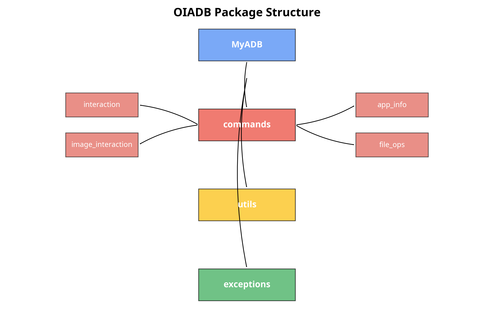
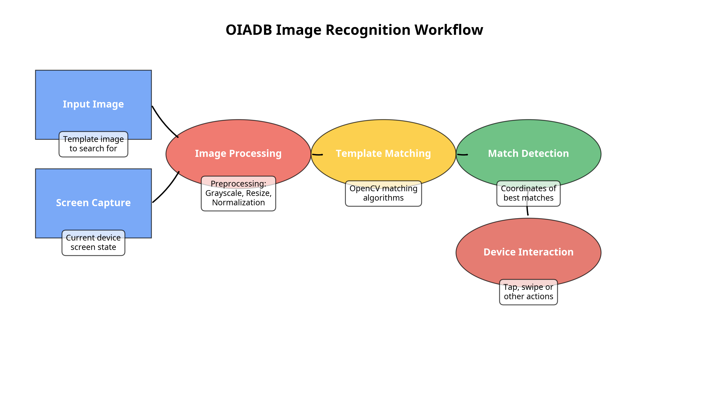
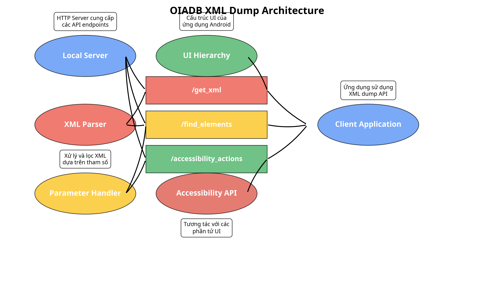
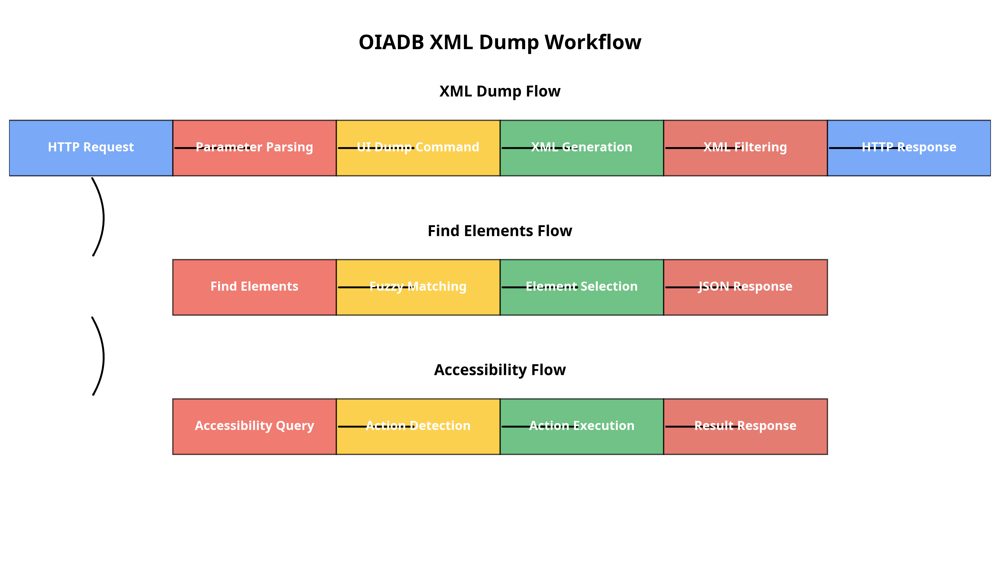

# OI ADB

Thư viện Python wrapper cho Android Debug Bridge (ADB) với chức năng nhận diện hình ảnh sử dụng OpenCV và tính năng dump XML với hỗ trợ trợ năng.

## Giới thiệu

OI ADB là một thư viện Python giúp tương tác với thiết bị Android thông qua ADB (Android Debug Bridge). Thư viện này được thiết kế để đơn giản hóa việc sử dụng các lệnh ADB trong các ứng dụng Python, tự động hóa kiểm thử, và quản lý thiết bị Android. 

Phiên bản mới nhất bổ sung:
- Chức năng nhận diện hình ảnh mạnh mẽ sử dụng OpenCV, cho phép tìm kiếm và tương tác với các phần tử trên màn hình dựa trên hình ảnh mẫu thay vì tọa độ cố định
- Tính năng dump XML với local server, cho phép truy xuất và phân tích cấu trúc UI nhanh chóng
- Hỗ trợ trợ năng (accessibility) để tương tác với ứng dụng Android một cách hiệu quả hơn

## Cấu trúc thư viện

Dưới đây là sơ đồ cấu trúc của thư viện OIADB:



Thư viện được tổ chức thành các module chính:
- **MyADB**: Lớp chính để tương tác với ADB
- **commands**: Chứa các lệnh chuyên biệt như tương tác, quản lý ứng dụng, thao tác file
- **utils**: Các tiện ích và công cụ hỗ trợ
- **exceptions**: Định nghĩa các ngoại lệ đặc biệt của thư viện

## Quy trình nhận diện hình ảnh

Một trong những tính năng nổi bật của OIADB là khả năng nhận diện và tương tác với các phần tử trên màn hình dựa trên hình ảnh. Dưới đây là quy trình hoạt động của tính năng này:



Quy trình bao gồm các bước:
1. **Input Image**: Hình ảnh mẫu cần tìm kiếm
2. **Screen Capture**: Chụp màn hình thiết bị hiện tại
3. **Image Processing**: Tiền xử lý hình ảnh (chuyển đổi grayscale, thay đổi kích thước, chuẩn hóa)
4. **Template Matching**: Sử dụng thuật toán so khớp mẫu của OpenCV
5. **Match Detection**: Xác định tọa độ của các vị trí khớp tốt nhất
6. **Device Interaction**: Thực hiện các thao tác như nhấn, vuốt tại vị trí đã xác định

## Tính năng XML Dump và Trợ Năng

Tính năng mới nhất của OIADB là khả năng dump XML của giao diện người dùng Android và tương tác thông qua API trợ năng. Dưới đây là kiến trúc của tính năng này:



Kiến trúc bao gồm:
- **Local Server**: HTTP server chạy trên thiết bị Android
- **XML Parser**: Bộ phân tích XML với khả năng lọc nhanh
- **Parameter Handler**: Xử lý các tham số truy vấn
- **API Endpoints**: Các điểm cuối API (/get_xml, /find_elements, /accessibility_actions)
- **Accessibility API**: Tích hợp với API trợ năng của Android

Quy trình xử lý của tính năng XML Dump:



Quy trình bao gồm ba luồng chính:
1. **XML Dump Flow**: Truy xuất và lọc cấu trúc XML
2. **Find Elements Flow**: Tìm kiếm các phần tử UI dựa trên tiêu chí
3. **Accessibility Flow**: Thực hiện các hành động trợ năng

## Yêu cầu

- Python 3.6 trở lên
- ADB đã được cài đặt và có trong PATH
- OpenCV (tự động cài đặt khi cài đặt thư viện)
- NumPy (tự động cài đặt khi cài đặt thư viện)

## Cài đặt

```bash
pip install oiadb
```

Hoặc cài đặt từ mã nguồn:

```bash
git clone https://github.com/tiendung102k3/oiadb
cd oiadb
pip install -e .
```

## Cách sử dụng

### Khởi tạo

```python
from oiadb import MyADB

# Khởi tạo với thiết bị mặc định
adb = MyADB()

# Hoặc chỉ định thiết bị cụ thể
adb = MyADB(device_id="emulator-5554")
```

### Các thao tác cơ bản

```python
# Liệt kê các thiết bị đã kết nối
devices = adb.get_devices()
print(devices)

# Cài đặt ứng dụng
adb.install_app("/path/to/app.apk")

# Gỡ cài đặt ứng dụng
adb.uninstall_app("com.example.app")

# Khởi động lại thiết bị
adb.reboot_device()
```

### Tương tác với thiết bị

```python
from oiadb.commands import interaction

# Nhấn vào tọa độ màn hình
interaction.tap(500, 500)

# Vuốt màn hình
interaction.swipe(100, 500, 600, 500)

# Nhập văn bản
interaction.text_input("Hello World")

# Nhấn phím Home
interaction.home()
```

### Tương tác dựa trên nhận diện hình ảnh

```python
from oiadb.commands import image_interaction

# Tìm và nhấp vào hình ảnh
image_interaction.tap_image("/path/to/button.png", threshold=0.8)

# Đợi hình ảnh xuất hiện và nhấp vào
image_interaction.wait_and_tap_image("/path/to/button.png", timeout=10)

# Kiểm tra xem hình ảnh có xuất hiện không
if image_interaction.is_image_present("/path/to/element.png"):
    print("Hình ảnh xuất hiện trên màn hình")

# Kéo từ hình ảnh này đến hình ảnh khác
image_interaction.drag_image_to_image("/path/to/source.png", "/path/to/target.png")
```

### Sử dụng XML Dump và Trợ Năng

```python
from oiadb.commands import xml_dump

# Khởi động server XML dump
server, server_thread = xml_dump.start_xml_server(port=8000)

# Lấy XML dump của giao diện hiện tại
xml_content = xml_dump.get_xml_dump()

# Tìm phần tử với nhiều tiêu chí
buttons = xml_dump.find_elements_by_criteria({
    "class": "android.widget.Button",
    "value": "Login",
    "threshold": 0.7
})

# Thực hiện hành động trợ năng
xml_dump.perform_accessibility_action(
    "click", 
    {"id": "button_login"}
)

# Dừng server khi hoàn tất
xml_dump.stop_xml_server(server)
```

### Quản lý file

```python
from oiadb.commands import file_ops

# Đẩy file từ máy tính lên thiết bị
file_ops.push("/path/on/computer", "/path/on/device")

# Lấy file từ thiết bị về máy tính
file_ops.pull("/path/on/device", "/path/on/computer")
```

### Xem log

```python
from oiadb.commands import logs

# Xem logcat
logcat_output = logs.logcat()
print(logcat_output)

# Tạo báo cáo lỗi
bugreport = logs.bugreport()
```

## Tài liệu API

### Lớp MyADB

Lớp chính để tương tác với ADB.

- `__init__(device_id=None)`: Khởi tạo đối tượng ADB với ID thiết bị tùy chọn
- `run(command)`: Chạy lệnh ADB tùy chỉnh
- `get_devices()`: Liệt kê các thiết bị đã kết nối
- `reboot_device()`: Khởi động lại thiết bị
- `install_app(apk_path)`: Cài đặt ứng dụng từ file APK
- `uninstall_app(package_name)`: Gỡ cài đặt ứng dụng
- `push_file(local_path, remote_path)`: Đẩy file lên thiết bị
- `pull_file(remote_path, local_path)`: Lấy file từ thiết bị
- `get_device_info()`: Lấy thông tin thiết bị

### Module commands

Các module lệnh chuyên biệt:

- `app_info`: Lấy thông tin ứng dụng
- `apps`: Quản lý ứng dụng
- `basic`: Các lệnh ADB cơ bản
- `connect`: Kết nối thiết bị qua mạng
- `device_actions`: Các hành động thiết bị
- `device_info`: Thông tin thiết bị
- `file_ops`: Thao tác file
- `interaction`: Tương tác với thiết bị
- `image_interaction`: Tương tác dựa trên nhận diện hình ảnh
- `xml_dump`: Dump XML và tương tác qua trợ năng
- `logs`: Xem log thiết bị
- `permissions`: Quản lý quyền

### Tài liệu bổ sung
Đọc tài liệu [tại đây](https://github.com/tiendung102k3/oiadb/tree/main/docs)
Để biết thêm chi tiết về chức năng nhận diện hình ảnh, vui lòng xem [image_recognition_documentation.md](https://github.com/tiendung102k3/oiadb/blob/main/image_recognition_documentation.md).
Để biết thêm chi tiết về tính năng XML dump và trợ năng, vui lòng xem [xml_dump_documentation.md](https://github.com/tiendung102k3/oiadb/blob/main/xml_dump_documentation.md).

## Đóng góp

Đóng góp luôn được chào đón! Vui lòng tạo issue hoặc pull request trên GitHub.

## Giấy phép

MIT License

## Liên hệ hợp tác

Email: monstertattoovn696@gmail.com
